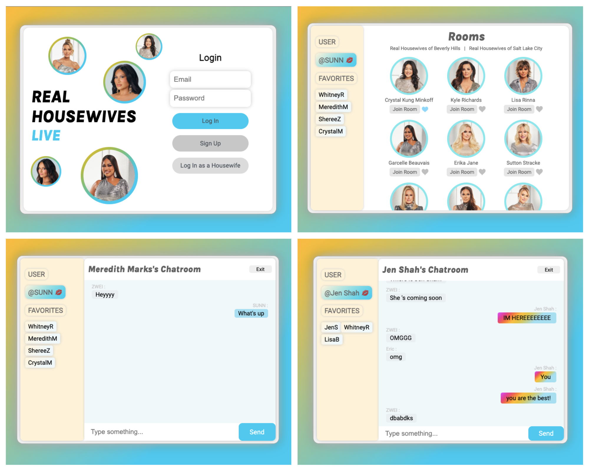

# Real Housewives Live Chat Room

Welcome to the Real Housewives Live Chat Room app! This is a platform for Real Housewives fans to communicate with each other and engage with Bravolebrities, the reality TV stars from Bravo shows.

## About
The Real Housewives Live Chat Room app provides a virtual space for Real Housewives fans to connect and discuss their favorite shows, characters, and episodes. Users can chat with each other in real-time and participate in group discussions. The app also provides an opportunity for fans to engage with Bravolebrities and ask them questions.

<br />

Here are some screenshots of the app:



## Built With

This app was built using the following tech stack:

<ul>
<li>React</li>
<li>Node</li>
<li>Express</li>
<li>Webpack</li>
<li>Socket.io</li>

</ul>

## Getting Started

This project is still in development. If you'd like to check it out, please follow the instructions below.

#### STEP 1 — Clone the repository

```sh
git clone https://github.com/zhaowei-sun/real-housewives-live/
```

#### STEP 2 — Start the application! The `npm start` script will start both our frontend and backend interface.

```sh
npm start
```

#### STEP 3 — Navigate to localhost:8080 to try out the chat room application!

```sh
http://localhost:8080/
```

## Roadmap
Here are some features that we plan to implement in the future:

<p></p>

<ul>
<li>Notifications when the show is on and when the Bravolebrity is in the chat room</li>
<li>Moderation on messages to make sure the rooms are safe spaces</li>
<li>Create testing suites to ensure functionality during development
<ul>
<li>Unit tests</li>
<li>Integration tests</li>
<li>End-to-end tests</li>
</ul></li>
</ul>

<br />

See the <a href="https://github.com/zhaowei-sun/real-housewives-live/issues" target="_blank">open issues</a> for a full list of proposed features (and known issues).

## License
Distributed under the MIT License. See LICENSE.txt for more information.

## Show Your Support
If you find this project helpful, please give it a ⭐️.
